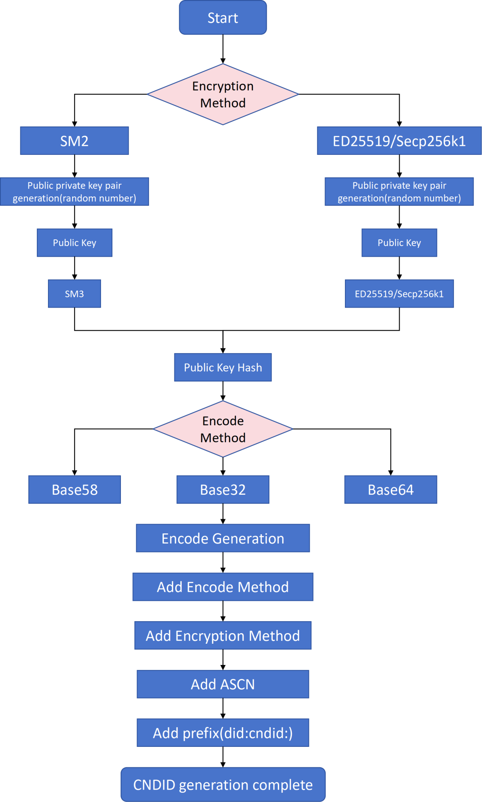

# CNDID Protocol Specification

Version 1.0.0

## About

CNDID (China Decentralized Identifier) is a decentralized identity identification system built on blockchain technology, designed to provide users with secure, trustworthy, and privacy-protected identity identification services. CNDID is a type of decentralized identifier (DID) that is applicable to blockchain networks and supports identity identification and authentication for individuals, enterprises, devices, and digital objects. For more information on DIDs and DID method specifications, please refer to [DID Primer](https://github.com/WebOfTrustInfo/rebooting-the-web-of-trust-fall2017/blob/master/topics-and-advance-readings/did-primer.md) and [DID Specification](https://w3c.github.io/did-core/).

## Summary

CNDID provides digital identity services for individuals, enterprises, devices, and digital objects based on blockchain technology, aiming to build a decentralized, rights-decentralized, data-secure, and privacy-protected identifier system. Through CNDID, trustworthy connections, interactions, and interoperability can be achieved, promoting the development of the digital economy.

## Document Status

This document is version v1.0.0 of the CNDID protocol specification. The latest version of the document can be obtained from the [CNDID Official Documentation Repository](https://github.com/teleinfo-bif/cndid).

## 1. CNDID Namespace

- The name string that shall identify this `DID` method is `cndid`
- A `DID` that generated by this method **MUST** begin with the following prefix: `did:cndid`. Per the DID specification, this string **MUST** be lowercase. The remaining part of the `DID`, following the prefix, is generated with postceding algorithm.

## 2. System Requirement

- This `DID` method is applicable to the blockchain network and has been used formally since the network released.

## 3. CNDID Identifier

### 3.1 CNDID

- `CNDID` is structured as following::


- `did:cndid:tele` is a special kind of `CNDID`, not encompsassing the postfix. It stores sidechain resolution service, and its resolution addresse can be found in the corresponding `CNDID` documentation.
- `CNDID` is initialized by the following `ABNF`:

```plaintext
cndid-did = "did:cndid:" cndid-specific-identifier ; fixed prefix did:cndid
cndid-specific-identifier = 0*1(acsn ":") suffix / acsn ":" 0*1(suffix)
acsn (optional): suffix or acsn: suffix (optional)
acsn = 4(ALPHA / DIGIT); a combination of 4 letters or digits
suffix = (22,42)(ALPHA / DIGIT); a combination of letters or digits with a length range of 22-42
```

- The steps for generating a CNDID address are defined as follows:

1. Select an encryption algorithm (e.g., SM2, ED25519, or Secp256k1).
2. Generate a public-private key pair.
3. Encode the public key using Base58, Base64, or Base32 encoding methods.
4. Concatenate the prefix `did:cndid:` with the encoded public key string to form the complete CNDID.



Encryption methods:

| Cryptographic Algorithm | Encryption Type |
| ----------------------- | --------------- |
| SM2                     | 'z'             |
| ED25519                 | 'e'             |
| Secp256k1               | 's'             |

Encoding methods:

| Encoding Algorithm | Encoding Type |
| ------------------ | ------------- |
| Base58             | 'f'           |
| Base64             | 's'           |
| Base32             | 't'           |

## 4. CNDID Document Specification

### 4.1 CNDID Specification Description

 `CNDID` documentation follows from that of `DID`'s, and makes some extension. Specified keywords are:

- `context`: required field, explanation of `JSON-LD`, following `DID` documentation.It is used to realize the interoperation of different `DID` Documents,which must include https://www.w3.org/ns/did/v1 .
- `version`: required field, documentation version, used for version upgrade
- `id`: required field, documentation `CNDID`
- `publicKey`: optional field, a set of `publicKey`, including
  - `id`, `publicKey`'s id
  - `type`, encryption method,support SM2, Ed25519, and Secp256k1.
  - `controller`, a `CNDID`, indicating the ownership of public key.
  - `publicKeyHex`, `publicKey`'s hex encode
- `authentication`: required field, `CNDID` of a set of`publicKey`, revealing the holder of the `CNDID`.The party that owns the public key corresponding to the private key can control and manage the `CNDID` document.
- `alsoKnownAs`: optional field, a set of `ID` related to `CNDID`, including
  - `type`, related identifiers' types
  - `id`, related identifiers.
- `extension`: extension field, including
  - `recovery`, optional field, `id` of a set of `publicKey` used to recover control when `authentication privateKey` is compromised or lost
  - `ttl`, required field, Time-To-Live, when resolution service requires usage of cache
  - `delegateSign`, optional field, third party signature to `publicKey`, used for trusted resolution, including
    - `signer`, `id` of `publicKey`
    - `signatureValue`, signature generated with `publicKey`'s corresponding `privateKey`
  - `type`, property type of `CNDID` documentation
- `attributes`: required field, a set of properties, including

| Parameter | Description                                                  |
| --------- | ------------------------------------------------------------ |
| key       | keyword of property                                          |
| desc      | optional field, description of property                      |
| encrypt   | optional field, whether to encrypt or not, 0 is not, 1 otherwise |
| format    | optional field, image,text,video,mixture or other data type  |
| value     | optional field, user-defined value of property               |

- `acsns`: optional field, side-chain `AC` code. `CNDID` documentation is the sole type not belonging to credential type. On extra, only `CNDID` documentation on main-chain can have this field, encapsulating all of the `AC` codes.
- `verifiableCredentials`: optional field, credentials list, including:
  - `id`, CNDID of verifiable claim
  - `type`,  type of credentials
- `service`: optional field comprising service addresses, including
  - `id`, service address' `id`
  - `type`, string representing service type
  - `serviceEndPoint`, `URI` address
- `created`: mandatory field, time of creation
- `updated`: mandatory field, time of last update
- `proof`: optional field, documentation owner's signature on documentation's content, including
  - `creator`, creator of `proof`, `id` of `publicKey`
  - `signatureValue`, signature on the entire documentation except `proof` field

### 4.2 CNDID Structure Definition

**DIDDocument**

| Field Name     | Type          | Description                                                  | Optional |
| -------------- | ------------- | ------------------------------------------------------------ | -------- |
| Context        | []string      | Context information of the DID document, usually containing the JSON-LD context URL. | Required |
| Version        | string        | Version number of the DID document.                          | Required |
| ID             | string        | Unique identifier of the DID.                                | Required |
| PublicKey      | []PublicKey   | Array of public key information, containing public keys associated with the DID. | Required |
| Authentication | []string      | List of public key IDs used for authentication.              | Required |
| AlsoKnownAs    | []AlsoKnownAs | List of other DIDs associated with the current DID.          | Optional |
| Extension      | Extension     | Extension field, containing additional metadata or configuration information. | Required |
| Service        | []Service     | Array of service information associated with the DID.        | Optional |
| Created        | string        | Creation time of the DID document.                           | Required |
| Updated        | string        | Last update time of the DID document.                        | Required |
| Proof          | Proof         | Signature information, used to verify the integrity and source of the DID document. | Optional |

**PublicKey**

| Field Name   | Type   | Description                                   | Optional |
| ------------ | ------ | --------------------------------------------- | -------- |
| ID           | string | Unique identifier of the public key.          | Required |
| Type         | string | Type of the public key, e.g., "SECP256K1".    | Required |
| Controller   | string | DID controlling this public key.              | Required |
| PublicKeyHex | string | Hexadecimal representation of the public key. | Required |

**AlsoKnownAs**

| Field Name | Type   | Description                | Optional |
| ---------- | ------ | -------------------------- | -------- |
| Type       | int    | Type of the associated ID. | Required |
| ID         | string | Associated DID.            | Required |

**Extension**

| Field Name            | Type                   | Description                                                  | Optional |
| --------------------- | ---------------------- | ------------------------------------------------------------ | -------- |
| Recovery              | []string               | List of public key IDs used for DID recovery.                | Optional |
| TTL                   | uint                   | Cache duration in seconds.                                   | Required |
| DelegateSign          | DelegateSign           | Delegated signature information.                             | Optional |
| Type                  | uint                   | Type of the extension field.                                 | Required |
| Attributes            | []Attribute            | List of attributes, containing additional information related to the DID. | Required |
| VerifiableCredentials | []VerifiableCredential | List of verifiable credentials.                              | Optional |

**DelegateSign**

| Field Name     | Type   | Description                   | Optional |
| -------------- | ------ | ----------------------------- | -------- |
| Signer         | string | ID of the signing public key. | Required |
| SignatureValue | string | Value of the signature.       | Required |

**Attribute**

| Field Name | Type   | Description                                              | Optional |
| ---------- | ------ | -------------------------------------------------------- | -------- |
| Key        | string | Key of the attribute.                                    | Required |
| Desc       | string | Description of the attribute.                            | Optional |
| Encrypt    | uint   | Whether encrypted, 0 for non-encrypted, 1 for encrypted. | Optional |
| Format     | string | Data type, e.g., "text", "image", etc.                   | Optional |
| Value      | string | Value of the attribute.                                  | Optional |

**VerifiableCredential**

| Field Name | Type   | Description                          | Optional |
| ---------- | ------ | ------------------------------------ | -------- |
| ID         | string | Unique identifier of the credential. | Required |
| Type       | uint   | Type of the credential.              | Required |

**Service**

If the `type` is a sub-chain resolution service, the service is structured as follows:

| Field Name      | Type   | Description                                | Optional |
| --------------- | ------ | ------------------------------------------ | -------- |
| ID              | string | Unique identifier of the service.          | Required |
| Type            | string | DIDSubResolver                             | Required |
| Version         | string | Version of the service.                    | Required |
| ServerType      | uint   | Type of the service address.               | Required |
| Protocol        | uint   | Type of protocol supported by the service. | Required |
| ServiceEndpoint | string | Endpoint URL of the service.               | Required |
| Port            | uint   | Port number of the service.                | Required |

Otherwise, it is structured as follows:

| Field Name      | Type   | Description                       | Optional |
| --------------- | ------ | --------------------------------- | -------- |
| ID              | string | Unique identifier of the service. | Required |
| Type            | string | Type of the service.              | Required |
| ServiceEndpoint | string | Endpoint URL of the service.      | Required |

**Proof**

| Field Name     | Type   | Description                                      | Optional |
| -------------- | ------ | ------------------------------------------------ | -------- |
| Creator        | string | ID of the public key that created the signature. | Required |
| SignatureValue | string | Value of the signature.                          | Required |

### 4.3 CNDID Document Example:

```json
{
    "context": ["https://www.w3.org/ns/did/v1"],
    "version": "1.0.0",
    "id": "did:cndid:efnVUgqQFfYeu97ABf6sGm3WFtVXHZB2",
    "publicKey": [{
        "id": "did:cndid:efnVUgqQFfYeu97ABf6sGm3WFtVXHZB2#key-1",
        "type": "Ed25519",
        "controller": "did:cndid:efnVUgqQFfYeu97ABf6sGm3WFtVXHZB2",
        "publicKeyHex": "b9906e1b50e81501369cc777979f8bcf27bd1917d794fa6d5e320b1ccc4f48bb"
    }],
    "authentication": ["did:cndid:efnVUgqQFfYeu97ABf6sGm3WFtVXHZB2#key-1"],
    "extension": {
        "recovery": ["did:cndid:efnVUgqQFfYeu97ABf6sGm3WFtVXHZB2#key-2"],
        "ttl": 86400,
        "delegateSign": {
            "signer": "did:cndid:efJgt44mNDewKK1VEN454R17cjso3mSG#key-1",
            "signatureValue": "eyJhbGciOiJSUzI1NiIsImI2NCI6ZmFsc2UsImNyaXQiOlsiYjY0Il19"
        },
        "type": 206
    },
    "service": [{
        "id": "did:cndid:ef24NBA7au48UTZrUNRHj2p3bnRzF3YCH#subResolve",
        "type": "IDPointerResolve",
        "serviceEndpoint": "https://resolver.cndid.org"
    }],
    "created": "2021-05-10T06:23:38Z",
    "updated": "2021-05-10T06:23:38Z",
    "proof": {
        "creator": "did:cndid:efJgt44mNDewKK1VEN454R17cjso3mSG#key-1",
        "signatureValue": "9E07CD62FE6CE0A843497EBD045C0AE9FD6E1845414D0ED251622C66D9CC927CC21DB9C09DFF628DC042FCBB7D8B2B4901E7DA9774C20065202B76D4B1C15900"
    }
}
```

## 5. CNDID Methods

### 5.1 Create

The registration interface primarily completes the registration of the CNDID document, supporting the HTTP POST method. When creating a CNDID document, the signer of the `proof` field must be the `public key` in the `authentication` field to successfully create it. If the CNDID document already exists, duplicate creation is not allowed.

#### Request Parameters

| Parameter   | Field Type | Description                  |
| ----------- | ---------- | ---------------------------- |
| id          | String     | CNDID to be created          |
| operation   | String     | "create"                     |
| didDocument | Object     | CNDID document to be created |

#### Request Example

```json
{
    "id": "did:cndid:sf24eYrmwXt6nx4fig3XJm7n9UP6PNRJ3",
    "operation": "create",
    "didDocument": {
        "context": [
            "https://www.w3.org/ns/did/v1"
        ],
        "version": "1.0.0",
        "id": "did:cndid:sf24eYrmwXt6nx4fig3XJm7n9UP6PNRJ3",
        "publicKey": [
            {
                "id": "did:cndid:sf24eYrmwXt6nx4fig3XJm7n9UP6PNRJ3",
                "type": "SECP256K1",
                "controller": "did:cndid:sf24eYrmwXt6nx4fig3XJm7n9UP6PNRJ3",
                "publicKeyHex": "04730dd9bd6256a6ffc03766e2d5b349f3734b7410116750b188b6d26b2ba092cf8c1ff07e6d61529a535681cb82f6e60501ca9ee2c1a672df631ff9a72a21c26b"
            },
            {
                "id": "did:cndid:sf6hQeifqQ56d2DBwFfYb4ByHtubkLLX",
                "type": "SECP256K1",
                "controller": "did:cndid:sf6hQeifqQ56d2DBwFfYb4ByHtubkLLX",
                "publicKeyHex": "04611176548da4a758187950dc2708a58ff7b4978c38cd9ae0961b889b74fa2f7be8592d69592bb2ffbc5315f8a563f479671ecf422d2ebd38d38c84c0d451b65c"
            },
            {
                "id": "did:cndid:sfXcZzrTnceK7PC67Pub2GD5Ps7EFqh4",
                "type": "SECP256K1",
                "controller": "did:cndid:sfXcZzrTnceK7PC67Pub2GD5Ps7EFqh4",
                "publicKeyHex": "04dd05980091d890191b128f29f46fce235b3e10f46cc9faab11de70d9f808e86769a9a955683eac7f3d40edc369d8c08492637493a0e72cc2838939980cfdb068"
            },
            {
                "id": "did:cndid:sfS6wbcHxZ9a9d4u1iMmmPNGSMWTpSJP",
                "type": "SECP256K1",
                "controller": "did:cndid:sfS6wbcHxZ9a9d4u1iMmmPNGSMWTpSJP",
                "publicKeyHex": "04a1617f65ae9683820f8c9bd73d1cb85a98969359ddafe1c99de3a36d00d156968aedceeec71b98c9a9727aa63a55a5349f830dbc7ced5b9518c04e4bb4c76328"
            }
        ],
        "authentication": [
            "did:cndid:sf24eYrmwXt6nx4fig3XJm7n9UP6PNRJ3",
            "did:cndid:sf6hQeifqQ56d2DBwFfYb4ByHtubkLLX"
        ],
        "extension": {
            "recovery": [
                "did:cndid:sfXcZzrTnceK7PC67Pub2GD5Ps7EFqh4"
            ],
            "ttl": 86400,
            "type": 206,
            "attributes": [
                {
                    "key": "201"
                }
            ]
        },
        "service": [
            {
                "id": "did:cndid:sfS6wbcHxZ9a9d4u1iMmmPNGSMWTpSJP",
                "type": "IDPointerResolve",
                "serviceEndpoint": "192.168.1.23"
            }
        ],
        "created": "2025-03-22T09:37:16Z",
        "updated": "2025-03-22T09:37:16Z",
        "proof": {
            "creator": "did:cndid:sf24eYrmwXt6nx4fig3XJm7n9UP6PNRJ3",
            "signatureValue": "2ExbMiHRpGSWxyZAwGgD4YnWUyXxhsp4F8mwGzE43VNrS3p3kru8JroVuox8AyXpyZrPhoepAUVtLwn3HyKnoXFcx1n"
        }
    }
}
```

#### Response Example

```json
{
    "errorCode": 0,
    "message": "success"
}
```

### 5.2 Read

The CNDID document information corresponding to the CNDID can be queried through the CNDID, supporting the HTTP GET method. The return value is the JSON string of the CNDID document.

#### Request Parameters

| Parameter | Field Type | Description          |
| --------- | ---------- | -------------------- |
| id        | String     | The CNDID to be read |
| operation | String     | "read"               |

#### Request Example

```plaintext
{
    "id": "did:cndid:sf24eYrmwXt6nx4fig3XJm7n9UP6PNRJ3",
    "operation": "read"
}
```

#### Response Data

| Parameter                                              | Field Type    | Description                                                  |
| ------------------------------------------------------ | ------------- | ------------------------------------------------------------ |
| errorCode                                              | Int           | See response code description                                |
| data.didDocument                                       | Object        | Resolution result                                            |
| data.didDocument.context                               | Array         | A set of URL arrays                                          |
| data.didDocument.version                               | String        | Version of the CNDID document                                |
| data.didDocument.id                                    | String        | Resolved CNDID                                               |
| data.didDocument.publicKey                             | Array(Object) | Public key                                                   |
| data.didDocument.publicKey.id                          | String        | Public key ID                                                |
| data.didDocument.publicKey.type                        | String        | Type of public key algorithm                                 |
| data.didDocument.publicKey.controller                  | String        | A CNDID indicating the ownership of this public key          |
| data.didDocument.publicKey.publicKeyHex                | String        | Hexadecimal public key                                       |
| data.didDocument.authentication                        | Array         | A set of public key IDs                                      |
| data.didDocument.alsoKnownAs                           | Array(Object) | Associated ID                                                |
| data.didDocument.alsoKnownAs.type                      | Int           | Type of associated ID                                        |
| data.didDocument.alsoKnownAs.id                        | String        | Associated ID                                                |
| data.didDocument.extension                             | Object        | Extension field                                              |
| data.didDocument.extension.recovery                    | Array         | A set of public key IDs                                      |
| data.didDocument.extension.ttl                         | long          | Cache duration in seconds                                    |
| data.didDocument.extension.delegateSign                | Object        | Third-party signature on the publicKey for trusted resolution |
| data.didDocument.extension.delegateSign.signer         | String        | Signing public key ID                                        |
| data.didDocument.extension.delegateSign.signatureValue | String        | Base58-encoded signature                                     |
| data.didDocument.extension.type                        | Int           | Attribute type                                               |
| data.didDocument.extension.attributes                  | Array(Object) | A set of attributes, see attribute structure below           |
| data.didDocument.extension.acsns                       | Array(Object) | List of AC numbers                                           |
| data.didDocument.extension.verfiableCredentials        | Array(Object) | List of credentials, only non-credential type BID documents on the main chain may have this field |
| data.didDocument.extension.verfiableCredentials.id     | String        | Credential ID                                                |
| data.didDocument.extension.verifiableCredentials.type  | Int           | Type of credential                                           |
| data.didDocument.service                               | Array(Object) | A set of service addresses, see table below for structure    |
| data.didDocument.service.id                            | String        | ID of the service address                                    |
| data.didDocument.service.type                          | String        | String representing the type of service                      |
| data.didDocument.service.serviceEndpoint               | String        | URL address of the service                                   |
| data.didDocument.created                               | String        | Creation time                                                |
| data.didDocument.updated                               | String        | Last update time                                             |
| data.didDocument.proof                                 | Object        | Signature information                                        |
| data.didDocument.proof.creator                         | String        | Signing public key ID                                        |
| data.didDocument.proof.signatureValue                  | String        | Base58-encoded signature                                     |

The structure of `attributes` is as follows:

| Parameter                                     | Field Type | Description                                             |
| --------------------------------------------- | ---------- | ------------------------------------------------------- |
| data.didDocument.extension.attributes.key     | String     | Key of the attribute                                    |
| data.didDocument.extension.attributes.desc    | String     | Description of the attribute                            |
| data.didDocument.extension.attributes.encrypt | Int        | Whether encrypted, 0 for non-encrypted, 1 for encrypted |
| data.didDocument.extension.attributes.format  | String     | Data types such as image, text, video, mixture, etc.    |
| data.didDocument.extension.attributes.value   | String     | Custom value for the attribute                          |

When `service.type` is a sub-chain resolution service, the structure of `service` is as follows:

| Parameter                                | Field Type | Description                                                  |
| ---------------------------------------- | ---------- | ------------------------------------------------------------ |
| data.didDocument.service.id              | String     | ID of the service address                                    |
| data.didDocument.service.type            | String     | String representing the type of service                      |
| data.didDocument.service.version         | String     | Version of the resolution service supported by the CNDID protocol |
| data.didDocument.service.protocol        | Int        | Transmission protocol supported by the resolution service    |
| data.didDocument.service.serverType      | Int        | Type of resolution address                                   |
| data.didDocument.service.serviceEndpoint | String     | Resolution address                                           |
| data.didDocument.service.port            | Int        | Resolution port                                              |

#### Response Example

- Successful response for a regular CNDID document:

```json
{
    "errorCode": 0,
    "data": {
        "didDocument": {
            "context": [
                "https://www.w3.org/ns/did/v1"
            ],
            "version": "1.0.0",
            "id": "did:cndid:sf24eYrmwXt6nx4fig3XJm7n9UP6PNRJ3",
            "publicKey": [
                {
                    "id": "did:cndid:sf24eYrmwXt6nx4fig3XJm7n9UP6PNRJ3",
                    "type": "SECP256K1",
                    "controller": "did:cndid:sf24eYrmwXt6nx4fig3XJm7n9UP6PNRJ3",
                    "publicKeyHex": "04730dd9bd6256a6ffc03766e2d5b349f3734b7410116750b188b6d26b2ba092cf8c1ff07e6d61529a535681cb82f6e60501ca9ee2c1a672df631ff9a72a21c26b"
                },
                {
                    "id": "did:cndid:sf6hQeifqQ56d2DBwFfYb4ByHtubkLLX",
                    "type": "SECP256K1",
                    "controller": "did:cndid:sf6hQeifqQ56d2DBwFfYb4ByHtubkLLX",
                    "publicKeyHex": "04611176548da4a758187950dc2708a58ff7b4978c38cd9ae0961b889b74fa2f7be8592d69592bb2ffbc5315f8a563f479671ecf422d2ebd38d38c84c0d451b65c"
                },
                {
                    "id": "did:cndid:sfXcZzrTnceK7PC67Pub2GD5Ps7EFqh4",
                    "type": "SECP256K1",
                    "controller": "did:cndid:sfXcZzrTnceK7PC67Pub2GD5Ps7EFqh4",
                    "publicKeyHex": "04dd05980091d890191b128f29f46fce235b3e10f46cc9faab11de70d9f808e86769a9a955683eac7f3d40edc369d8c08492637493a0e72cc2838939980cfdb068"
                },
                {
                    "id": "did:cndid:sfS6wbcHxZ9a9d4u1iMmmPNGSMWTpSJP",
                    "type": "SECP256K1",
                    "controller": "did:cndid:sfS6wbcHxZ9a9d4u1iMmmPNGSMWTpSJP",
                    "publicKeyHex": "04a1617f65ae9683820f8c9bd73d1cb85a98969359ddafe1c99de3a36d00d156968aedceeec71b98c9a9727aa63a55a5349f830dbc7ced5b9518c04e4bb4c76328"
                }
            ],
            "authentication": [
                "did:cndid:sf24eYrmwXt6nx4fig3XJm7n9UP6PNRJ3",
                "did:cndid:sf6hQeifqQ56d2DBwFfYb4ByHtubkLLX"
            ],
            "extension": {
                "recovery": [
                    "did:cndid:sfXcZzrTnceK7PC67Pub2GD5Ps7EFqh4"
                ],
                "ttl": 86400,
                "type": 206,
                "attributes": [
                    {
                        "key": "201"
                    }
                ]
            },
            "service": [
                {
                    "id": "did:cndid:sfS6wbcHxZ9a9d4u1iMmmPNGSMWTpSJP",
                    "type": "IDPointerResolve",
                    "serviceEndpoint": "192.168.1.23"
                }
            ],
            "created": "2025-03-22T09:37:16Z",
            "updated": "2025-03-22T09:37:16Z",
            "proof": {
                "creator": "did:cndid:sf24eYrmwXt6nx4fig3XJm7n9UP6PNRJ3",
                "signatureValue": "2ExbMiHRpGSWxyZAwGgD4YnWUyXxhsp4F8mwGzE43VNrS3p3kru8JroVuox8AyXpyZrPhoepAUVtLwn3HyKnoXFcx1n"
            }
        }
    }
}
```

- Successful response for a CNDID document containing a sub-chain resolution service address:

```json
{
    "errorCode": 0,
    "data": {
        "didDocument": {
            "context": [
                "https://www.w3.org/ns/did/v1"
            ],
            "version": "1.0.0",
            "id": "did:cndid:sf24eYrmwXt6nx4fig3XJm7n9UP6PNRJ3",
            "publicKey": [
                {
                    "id": "did:cndid:sf24eYrmwXt6nx4fig3XJm7n9UP6PNRJ3",
                    "type": "SECP256K1",
                    "controller": "did:cndid:sf24eYrmwXt6nx4fig3XJm7n9UP6PNRJ3",
                    "publicKeyHex": "04730dd9bd6256a6ffc03766e2d5b349f3734b7410116750b188b6d26b2ba092cf8c1ff07e6d61529a535681cb82f6e60501ca9ee2c1a672df631ff9a72a21c26b"
                },
                {
                    "id": "did:cndid:sf6hQeifqQ56d2DBwFfYb4ByHtubkLLX",
                    "type": "SECP256K1",
                    "controller": "did:cndid:sf6hQeifqQ56d2DBwFfYb4ByHtubkLLX",
                    "publicKeyHex": "04611176548da4a758187950dc2708a58ff7b4978c38cd9ae0961b889b74fa2f7be8592d69592bb2ffbc5315f8a563f479671ecf422d2ebd38d38c84c0d451b65c"
                },
                {
                    "id": "did:cndid:sfXcZzrTnceK7PC67Pub2GD5Ps7EFqh4",
                    "type": "SECP256K1",
                    "controller": "did:cndid:sfXcZzrTnceK7PC67Pub2GD5Ps7EFqh4",
                    "publicKeyHex": "04dd05980091d890191b128f29f46fce235b3e10f46cc9faab11de70d9f808e86769a9a955683eac7f3d40edc369d8c08492637493a0e72cc2838939980cfdb068"
                },
                {
                    "id": "did:cndid:sfS6wbcHxZ9a9d4u1iMmmPNGSMWTpSJP",
                    "type": "SECP256K1",
                    "controller": "did:cndid:sfS6wbcHxZ9a9d4u1iMmmPNGSMWTpSJP",
                    "publicKeyHex": "04a1617f65ae9683820f8c9bd73d1cb85a98969359ddafe1c99de3a36d00d156968aedceeec71b98c9a9727aa63a55a5349f830dbc7ced5b9518c04e4bb4c76328"
                }
            ],
            "authentication": [
                "did:cndid:sf24eYrmwXt6nx4fig3XJm7n9UP6PNRJ3",
                "did:cndid:sf6hQeifqQ56d2DBwFfYb4ByHtubkLLX"
            ],
            "extension": {
                "recovery": [
                    "did:cndid:sfXcZzrTnceK7PC67Pub2GD5Ps7EFqh4"
                ],
                "ttl": 86400,
                "type": 206,
                "attributes": [
                    {
                        "key": "201"
                    }
                ]
            },
            "service": [
                {
                    "id": "did:cndid:sfS6wbcHxZ9a9d4u1iMmmPNGSMWTpSJP",
                    "type": "DIDSubResolve",
                    "serviceEndpoint": "192.168.1.23",
                    "version": "1.0.0",
                    "serverType": 1,
                    "protocol": 3,
                    "port": 8080
                }
            ],
            "created": "2025-03-22T09:37:16Z",
            "updated": "2025-03-22T09:37:16Z",
            "proof": {
                "creator": "did:cndid:sf24eYrmwXt6nx4fig3XJm7n9UP6PNRJ3",
                "signatureValue": "2ExbMiHRpGSWxyZAwGgD4YnWUyXxhsp4F8mwGzE43VNrS3p3kru8JroVuox8AyXpyZrPhoepAUVtLwn3HyKnoXFcx1n"
            }
        }
    }
}
```

### 5.3 Update

The update interface primarily completes the update of the CNDID document, supporting the HTTP POST method. The update operation is not allowed to modify the `authentication` field. When updating the CNDID document, the signer of the `proof` field must be the `public key` in the `authentication` field to successfully update it.

| Parameter   | Field Type | Description                |
| ----------- | ---------- | -------------------------- |
| id          | String     | The CNDID to be updated    |
| operation   | String     | "update"                   |
| didDocument | Object     | The updated CNDID document |

#### Request Example

```json
{
    "id": "did:cndid:sf24eYrmwXt6nx4fig3XJm7n9UP6PNRJ3",
    "operation": "update",
    "didDocument": {
        "context": [
            "https://www.w3.org/ns/did/v1"
        ],
        "version": "1.0.0",
        "id": "did:cndid:sf24eYrmwXt6nx4fig3XJm7n9UP6PNRJ3",
        "publicKey": [
            {
                "id": "did:cndid:sf24eYrmwXt6nx4fig3XJm7n9UP6PNRJ3",
                "type": "SECP256K1",
                "controller": "did:cndid:sf24eYrmwXt6nx4fig3XJm7n9UP6PNRJ3",
                "publicKeyHex": "04730dd9bd6256a6ffc03766e2d5b349f3734b7410116750b188b6d26b2ba092cf8c1ff07e6d61529a535681cb82f6e60501ca9ee2c1a672df631ff9a72a21c26b"
            },
            {
                "id": "did:cndid:sf6hQeifqQ56d2DBwFfYb4ByHtubkLLX",
                "type": "SECP256K1",
                "controller": "did:cndid:sf6hQeifqQ56d2DBwFfYb4ByHtubkLLX",
                "publicKeyHex": "04611176548da4a758187950dc2708a58ff7b4978c38cd9ae0961b889b74fa2f7be8592d69592bb2ffbc5315f8a563f479671ecf422d2ebd38d38c84c0d451b65c"
            },
            {
                "id": "did:cndid:sfXcZzrTnceK7PC67Pub2GD5Ps7EFqh4",
                "type": "SECP256K1",
                "controller": "did:cndid:sfXcZzrTnceK7PC67Pub2GD5Ps7EFqh4",
                "publicKeyHex": "04dd05980091d890191b128f29f46fce235b3e10f46cc9faab11de70d9f808e86769a9a955683eac7f3d40edc369d8c08492637493a0e72cc2838939980cfdb068"
            },
            {
                "id": "did:cndid:sfS6wbcHxZ9a9d4u1iMmmPNGSMWTpSJP",
                "type": "SECP256K1",
                "controller": "did:cndid:sfS6wbcHxZ9a9d4u1iMmmPNGSMWTpSJP",
                "publicKeyHex": "04a1617f65ae9683820f8c9bd73d1cb85a98969359ddafe1c99de3a36d00d156968aedceeec71b98c9a9727aa63a55a5349f830dbc7ced5b9518c04e4bb4c76328"
            },
            {
                "id": "did:cndid:sf5iXTcoPvqKikeAMtvCCNHWaQoqA96t",
                "type": "SECP256K1",
                "controller": "did:cndid:sf5iXTcoPvqKikeAMtvCCNHWaQoqA96t",
                "publicKeyHex": "043f404ab3bf64c30526b5e588e89d59f304b8b8ba53204e002b1cea6a7827ccd64389cd351605b100e4a2e950a0a5a121d8fa4d3c3b4ab15ed94bf54770cd2a3c"
            }
        ],
        "authentication": [
            "did:cndid:sf24eYrmwXt6nx4fig3XJm7n9UP6PNRJ3",
            "did:cndid:sf6hQeifqQ56d2DBwFfYb4ByHtubkLLX"
        ],
        "extension": {
            "recovery": [
                "did:cndid:sfXcZzrTnceK7PC67Pub2GD5Ps7EFqh4"
            ],
            "ttl": 86400,
            "type": 206,
            "attributes": [
                {
                    "key": "201"
                }
            ]
        },
        "service": [
            {
                "id": "did:cndid:sfS6wbcHxZ9a9d4u1iMmmPNGSMWTpSJP",
                "type": "IDPointerResolve",
                "serviceEndpoint": "192.168.1.23"
            },
            {
                "id": "did:cndid:sf5iXTcoPvqKikeAMtvCCNHWaQoqA96t",
                "type": "IDHubResolve",
                "serviceEndpoint": "192.168.2.15"
            }
        ],
        "created": "2025-03-22T09:44:16Z",
        "updated": "2025-03-22T09:44:25Z",
        "proof": {
            "creator": "did:cndid:sf24eYrmwXt6nx4fig3XJm7n9UP6PNRJ3",
            "signatureValue": "hLDyzcMbSpaV74RRqaN7bBqbN43Zm8FfqQdUmmGkZitVRiV5sHYv2JEkyxCtNLtw1iMJzSaUtKwgUrjop5JCGdCPwN"
        }
    }
}
```

#### Response Example

```json
{
    "errorCode": 0,
    "message": "success"
}
```

### 5.4 Deactivate

The `Deactivate` interface primarily completes the revocation of the CNDID document, supporting the HTTP POST method. After revocation, the CNDID document is updated to an empty state rather than being deleted. To deactivate the CNDID document, the signer of the `proof` field must be the `public key` in the `recovery` field to successfully deactivate it.

| Parameter | Field Type | Description                                                  |
| --------- | ---------- | ------------------------------------------------------------ |
| id        | String     | The CNDID to be deactivated                                  |
| operation | String     | "delete"                                                     |
| proof     | Object     | Signature of the private key corresponding to the recovery public key |

#### Request Example

```json
{
    "id": "did:cndid:sf24eYrmwXt6nx4fig3XJm7n9UP6PNRJ3",
    "operation": "deactivate",
    "proof": {
        "creator": "did:cndid:sfXcZzrTnceK7PC67Pub2GD5Ps7EFqh4",
        "signatureValue": "w9uH8kx5kyo2vdsWz8aELJZhsdYPokf9Rnh67Yra5Lo49KHteAGmF7hzXiVmJVbXR7jMkDmj1zZuWqvfiKehenirUg"
    }
}
```

#### Response Example

```json
{
    "errorCode": 0,
    "message": "success"
}
```

### 5.5 Recovery

The `Recovery` interface primarily completes the modification of the `authentication` and `publicKey` fields in the CNDID document, supporting the HTTP POST method. To replace the keys, the signer of the `proof` field must be the `public key` in the `recovery` field to successfully replace it.

| Parameter   | Field Type | Description               |
| ----------- | ---------- | ------------------------- |
| id          | String     | The CNDID to be recovered |
| operation   | String     | "recovery"                |
| didDocument | Object     | The updated DID document  |

#### Request Example

```json
{
    "id": "did:cndid:sf24eYrmwXt6nx4fig3XJm7n9UP6PNRJ3",
    "operation": "recovery",
    "didDocument": {
        "context": [
            "https://www.w3.org/ns/did/v1"
        ],
        "version": "1.0.0",
        "id": "did:cndid:sf24eYrmwXt6nx4fig3XJm7n9UP6PNRJ3",
        "publicKey": [
            {
                "id": "did:cndid:sf24eYrmwXt6nx4fig3XJm7n9UP6PNRJ3",
                "type": "SECP256K1",
                "controller": "did:cndid:sf24eYrmwXt6nx4fig3XJm7n9UP6PNRJ3",
                "publicKeyHex": "04730dd9bd6256a6ffc03766e2d5b349f3734b7410116750b188b6d26b2ba092cf8c1ff07e6d61529a535681cb82f6e60501ca9ee2c1a672df631ff9a72a21c26b"
            },
            {
                "id": "did:cndid:sfXcZzrTnceK7PC67Pub2GD5Ps7EFqh4",
                "type": "SECP256K1",
                "controller": "did:cndid:sfXcZzrTnceK7PC67Pub2GD5Ps7EFqh4",
                "publicKeyHex": "04dd05980091d890191b128f29f46fce235b3e10f46cc9faab11de70d9f808e86769a9a955683eac7f3d40edc369d8c08492637493a0e72cc2838939980cfdb068"
            },
            {
                "id": "did:cndid:sfS6wbcHxZ9a9d4u1iMmmPNGSMWTpSJP",
                "type": "SECP256K1",
                "controller": "did:cndid:sfS6wbcHxZ9a9d4u1iMmmPNGSMWTpSJP",
                "publicKeyHex": "04a1617f65ae9683820f8c9bd73d1cb85a98969359ddafe1c99de3a36d00d156968aedceeec71b98c9a9727aa63a55a5349f830dbc7ced5b9518c04e4bb4c76328"
            }
        ],
        "authentication": [
            "did:cndid:sf24eYrmwXt6nx4fig3XJm7n9UP6PNRJ3"
        ],
        "extension": {
            "recovery": [
                "did:cndid:sfXcZzrTnceK7PC67Pub2GD5Ps7EFqh4"
            ],
            "ttl": 86400,
            "type": 206,
            "attributes": [
                {
                    "key": "201"
                }
            ]
        },
        "service": [
            {
                "id": "did:cndid:sfS6wbcHxZ9a9d4u1iMmmPNGSMWTpSJP",
                "type": "IDPointerResolve",
                "serviceEndpoint": "192.168.1.23"
            }
        ],
        "created": "2025-03-22T09:46:13Z",
        "updated": "2025-03-22T09:46:18Z",
        "proof": {
            "creator": "did:cndid:sfXcZzrTnceK7PC67Pub2GD5Ps7EFqh4",
            "signatureValue": "2ESSXREizoYDfkp7t5MnmqkaAtAykBi45ri2mkc3Tr1XHd1JQAnaMrxpnodqSFADw2SacNrHNmjf6KQb7BYBgyJbaKi"
        }
    }
}
```

#### Response Example

```json
{
    "errorCode": 0,
    "message": "success"
}
```

---

The above is the complete **CNDID Methods** section, including detailed descriptions and examples of the create, read, update, deactivate, and recovery operations.

## 6. Security and Privacy Considerations

### 6.1 Security Considerations

- **Public Key Integrity**: The public keys of CNDID are stored on the blockchain, ensuring their immutability.
- **Private Key Protection**: Private keys must be securely stored to prevent leakage to unauthorized third parties.
- **Preventing Man-in-the-Middle Attacks**: Protect the transmission of CNDID documents using encryption (e.g., TLS).
- **Identity Recovery Mechanism**: In case of private key loss, the main key can be reset using recovery keys.
- **Preventing DDoS Attacks**: The CNDID system, built on blockchain technology, is inherently resistant to DDoS attacks.
- **Preventing Privacy Data Theft Attacks**: In the CNDID system, all privacy-related data is stored locally. Only the hash or string generated by the encryption algorithm is publicly available on the chain, and attackers cannot derive private data from the hash or string.

### 6.2 Privacy Considerations

- **Data Minimization**: Only necessary information is stored on the blockchain, such as public keys and service endpoints, avoiding the storage of sensitive information.
- **Privacy Protection**: Use encryption techniques (e.g., homomorphic encryption) to protect sensitive data and prevent privacy leaks.
- **Access Control**: Control access to CNDID and its associated services using encryption methods.
- **Anonymization Techniques**: Use anonymization techniques (e.g., zero-knowledge proofs) to protect user privacy when necessary.